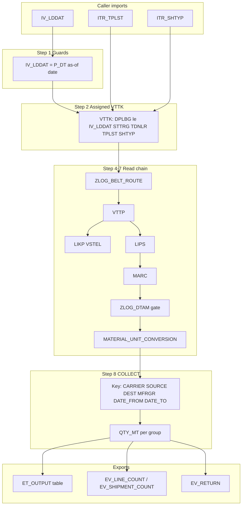

# Implementation Plan — `Z_LOG_GET_CARRIER_QTY` (RD2)

**Target system:** RD2  
**Authority:** [AC_Z_LOG_GET_CARRIER_QTY.md](c:\AI Development\17. ZLOG_CARRIER_QTY\AC_Z_LOG_GET_CARRIER_QTY.md) + [Phase 2 spec](c:\AI Development\17. ZLOG_CARRIER_QTY\Z_LOG_GET_CARRIER_QTY — Technical Specification (Phase 2).md) — **output interface superseded by this plan** (see §Output contract)  
**DOI alignment:** Grouped output restores DOI §4 intent (carrier + source + destination + MFRGR + date range) while keeping AC/spec selection imports  
**Reference (read-only):** `ZCARRASSIGN` (= `ZLOG_CARR_ASSIGN_NEW`), method `LE_CAR_ASSI` assigned-history path  
**Sibling pattern:** [rd2_fm_implementation_4fc23445.plan.md](c:\AI Development\16. ZLOG_GET_SHIPMENT_UNASSIGNED\.cursor\plans\rd2_fm_implementation_4fc23445.plan.md) — range-table guard + **`ET_OUTPUT` table** export pattern  
**Scope:** New FM + FG + DDIC output types only. **Do not modify** `ZCARRASSIGN` or any existing program.

---

## Plan revisions (2025-06-23)

| Change | Before | After |
|---|---|---|
| Encapsulation | `LZLOG_CARR_QTYF01` FORMs + `PERFORM` | `LCL_CARR_QTY` local class + `METHOD` calls in `LZLOG_CARR_QTYCLS` |
| Output | Single `EV_TOTAL_QTY` scalar | **`ET_OUTPUT`** table grouped by **Carrier · Source · Destination · MFRGR · DATE_FROM · DATE_TO** |
| Read chain | VTTK → belt → VTTP → LIPS → MARC → DTAM | Same + **`LIKP`** (source = `VSTEL`) |
| Date window | `IV_LDDAT ± ZSCM_GET_SHIPMENT_DATE` on `DPLBG` | **`IV_LDDAT` = `P_DT`**; line gate `DTAM-DATE_FROM ≤ DPLBG ≤ MIN(IV_LDDAT, DTAM-DATE_TO)` — matches `LE_CAR_ASSI` |

---

## Output contract

Each `ET_OUTPUT` row is one aggregated quantity (MT, 3 decimals) for a unique combination of:

| Output field | Source | Notes |
|---|---|---|
| `CARRIER` | `VTTK-TDNLR` | Assigned carrier vendor |
| `SOURCE` | `LIKP-VSTEL` | Shipping point on delivery (`VTTP-VBELN` → `LIKP`) |
| `DESTINATION` | `ZLOG_BELT_ROUTE-BELT` | Belt resolved from `VTTK-ROUTE` (Phase 2 §2.1) |
| `MFRGR` | `MARC-MFRGR` | Authoritative material freight group |
| `DATE_FROM` | `ZLOG_DTAM-DATE_FROM` | From the **matching** domestic belt-level DTAM row that gated the line |
| `DATE_TO` | `ZLOG_DTAM-DATE_TO` | From the same matched DTAM row |
| `QTY_MT` | Sum of converted line MT | Rounded to 3 decimals **after** `COLLECT` per group (AC-U03) |

**Aggregation:** `COLLECT` (or equivalent hash) on the six dimension keys; sum unrounded line MT within each group, then round `QTY_MT` to 3 decimals.

**Success semantics (revised from scalar AC-O02):**

| Outcome | `ET_OUTPUT` | `EV_RETURN` | Exception |
|---|---|---|---|
| Qualifying lines exist | ≥1 row with `QTY_MT` | TYPE `S` | None |
| VTTK exists, zero qualifying lines | initial | TYPE `W` | None |
| Empty range tables | initial | TYPE `E` | `NO_DATA_FOUND` |
| TVARVC missing | initial | TYPE `E` | `NO_DATA_FOUND` |
| No VTTK in window | initial | TYPE `E` | `NO_DATA_FOUND` |
| Conversion error | initial | TYPE `E` | `CONVERSION_ERROR` |

`EV_LINE_COUNT` / `EV_SHIPMENT_COUNT` remain **optional FM-level diagnostics** (total qualifying lines / distinct shipments across all groups).

> **Follow-up:** Update [AC_Z_LOG_GET_CARRIER_QTY.md](c:\AI Development\17. ZLOG_CARRIER_QTY\AC_Z_LOG_GET_CARRIER_QTY.md) and Phase 2 §3/§7 when output ACs are re-baselined.

---

## Date model — report-aligned (`IV_LDDAT` = `P_DT`)

**Semantic:** `IV_LDDAT` is the **planning / as-of date** (`P_DT` on `ZCARRASSIGN` selection screen), **not** the centre of a symmetric ±day window.

| Step | Rule | Field |
|---|---|---|
| VTTK bulk filter | `DPLBG ≤ IV_LDDAT` | Upper bound only at shipment select |
| Line inclusion | `ZLOG_DTAM-DATE_FROM ≤ DPLBG ≤ MIN(IV_LDDAT, ZLOG_DTAM-DATE_TO)` | MTD ∩ allocation validity per matched DTAM row |
| Output keys | `DATE_FROM` / `DATE_TO` from matched **DTAM row** | Same as report COLLECT dimensions |

**`ZSCM_GET_SHIPMENT_DATE` is not read** for this FM (that TVARVC belongs to the unassigned sibling FM).

### Worked example — `IV_LDDAT = 23.06.2026` (`20260623`)

**Inputs:**
```
IV_LDDAT  = 20260623
ITR_TPLST = EQ 1000
ITR_SHTYP = EQ 01
```

**Step 1 — VTTK select** (assigned, matching TPLST/SHTYP, `STTRG ≥ 1`, `TDNLR` filled):
```
VTTK-DPLBG ≤ 20260623
```
Shipments loaded **after** 23-Jun-2026 are excluded immediately. Shipments from earlier in June (or earlier months) remain candidates.

**Step 2 — Line gate** (example DTAM row: belt `B01`, MFRGR `M1`, `DATE_FROM = 20260601`, `DATE_TO = 20260630`):

| Shipment `DPLBG` | VTTK pass? | Line gate (`01-Jun ≤ DPLBG ≤ MIN(23-Jun, 30-Jun)`) | In `ET_OUTPUT`? |
|---|---|---|---|
| 15.06.2026 | Yes | Yes (`01 ≤ 15 ≤ 23`) | **Yes** — MTD quantity counts |
| 23.06.2026 | Yes | Yes (boundary) | **Yes** |
| 25.06.2026 | **No** (`25 > 23`) | — | **No** — after `P_DT` |
| 28.05.2026 | Yes | **No** if `DATE_FROM = 01-Jun` | **No** — before DTAM start |

**Step 3 — Output row** (if carrier `C100`, source `VST01`, destination belt `B01`):
```
CARRIER=B100  SOURCE=VST01  DESTINATION=B01  MFRGR=M1
DATE_FROM=20260601  DATE_TO=20260630  QTY_MT=<sum of qualifying lines>
```

**Contrast with old ±3-day plan** (`TVARVC-LOW = 3`): would only select `DPLBG` between **20.06.2026–26.06.2026**, missing the 15-Jun shipment the report would include.

---

## Assumptions

| ID | Assumption | Confidence | Impact if wrong |
|---|---|---|---|
| A1 | Selection imports remain **AC/spec** (`IV_LDDAT`, `ITR_TPLST`, `ITR_SHTYP` only) | **Confirmed** | No caller date/carrier filters |
| A2 | `ZCARRASSIGN` on RD2 = documented `ZLOG_CARR_ASSIGN_NEW` | **Confirmed** | User answered alias |
| A3 | Function group **`ZLOG_CARR_QTY`** in package **`$ZLOG`** | Medium | Rename in SE80 only |
| A4 | **`IV_LDDAT` = report `P_DT`** (planning/as-of date); no `ZSCM_GET_SHIPMENT_DATE` read | **Confirmed** | User chose report-aligned model |
| A5 | VTTK: **`DPLBG ≤ IV_LDDAT`**; line: **`DTAM-DATE_FROM ≤ DPLBG ≤ MIN(IV_LDDAT, DTAM-DATE_TO)`** | High | Matches `LE_CAR_ASSI` MTD logic |
| A6 | **`QUAN_13_3`** created unless equivalent exists in RD2 | Medium | Reuse if found |
| A7 | Range types **`TPLST_RANGE`** / **`SHTYP_RANGE`** if in DDIC; else `RANGE OF` | High | No functional change |
| A8 | **`STTRG >= '1'`** and **`TDNLR IS NOT INITIAL`** | High | Assigned-only |
| A9 | **`ZLOG_DTAM`** gate: domestic belt-level (`WERKS` initial); `DATE_FROM <= DPLBG <= DATE_TO` | High | DTAM dates become output keys |
| A10 | Unmapped `ROUTE` → line excluded (0 MT contribution) | High | Per Phase 2 |
| A11 | **`MARC-MFRGR`** authoritative; missing MARC → line excluded | High | AC-M01–M04 |
| A12 | **`MATERIAL_UNIT_CONVERSION`** when `VRKME <> 'MT'`; failure → `CONVERSION_ERROR` | High | AC-U06 |
| A13 | **`QTY_MT` rounded to 3 decimals after COLLECT** per output row | High | AC-U03 adapted |
| A14 | **`NO_DATA_FOUND`**: empty ranges OR empty VTTK; zero qualifying lines → **empty `ET_OUTPUT`, TYPE W** | High | Replaces scalar `EV_TOTAL_QTY=0` |
| A15 | FM **remote-enabled**; message class **`ZLOG`** for `EV_RETURN` where needed | Medium | Standard ZLOG |
| A16 | Phase 0 SE38 verifies `ZCARRASSIGN` conversion call pattern | Medium | Call signature only |
| A17 | Deliverable = SAP transport + optional `.txt` exports | High | No git until export |
| A18 | **`DATE_FROM`/`DATE_TO` in output = matched `ZLOG_DTAM` row**, not TVARVC window or `DPLBG` | **Confirmed** | User requirement |
| A19 | **One DTAM row per line** — first matching belt+MFRGR+date gate wins; its dates are the group key | High | If overlap, same as report COLLECT key |
| A20 | Logic in **`LCL_CARR_QTY`** local class (`METHOD`), not `FORM`/`PERFORM` | **Confirmed** | User requirement |

---

## Architecture



**Reference extraction map** (from `ZCARRASSIGN` / `LE_CAR_ASSI`):

| FM step | Reference pattern | Key difference from prior plan |
|---|---|---|
| VTTK select | `LT_MVTTK`: `TPLST`, `SHTYP`, `DPLBG ≤ P_DT`, `STTRG >= 1`, `TDNLR filled` | Caller ranges replace TVARVC tplst/shtyp lists |
| Date window | **`DTAM-DATE_FROM` → `MIN(P_DT, DTAM-DATE_TO)`** per line | `IV_LDDAT` = `P_DT`; no `ZSCM_GET_SHIPMENT_DATE` |
| Belt / dest | `ZLOG_BELT_ROUTE` via `VTTK-ROUTE` | `DESTINATION` in output |
| Source | `LIKP-VSTEL` via `VTTP-VBELN` | **New read** — Phase 2 §2.1 |
| MFRGR | `MARC` for `MATNR+WERKS` | Same |
| DTAM | Belt-level row gates line; dates in output key | Same gate, **exposed in output** |
| MT conversion | `MATERIAL_UNIT_CONVERSION` when `VRKME <> MT` | Same |
| Aggregation | Report groups belt+MFRGR+carrier | FM groups **carrier+source+destination+mfrgr+dtam dates** → `ET_OUTPUT` |

---

## Objects to Create in RD2

| # | Object | Type | Action |
|---|---|---|---|
| 1 | `QUAN_13_3` | Domain + data element (SE11) | Create *if not exists* |
| 2 | `ZLOG_S_CARRIER_QTY` | Structure (SE11) | **Create** — `ET_OUTPUT` line type |
| 3 | `ZLOG_TT_CARRIER_QTY` | Table type (SE11) | **Create** — line type `ZLOG_S_CARRIER_QTY` |
| 4 | `ZLOG_CARR_QTY` | Function group (SE80) | Create |
| 5 | `LZLOG_CARR_QTYTOP` | TOP include | Create — types, constants, `LCL_CARR_QTY` definition |
| 6 | `LZLOG_CARR_QTYCLS` | Local class impl include | **Create** — all METHOD bodies |
| 7 | `Z_LOG_GET_CARRIER_QTY` | Function module | Create |

**Dropped:** `LZLOG_CARR_QTYF01`; **`ZSCM_GET_SHIPMENT_DATE` TVARVC** (not used — `IV_LDDAT` is `P_DT`).

**Dropped:** `LZLOG_CARR_QTYF01` (forms include) — replaced by `LZLOG_CARR_QTYCLS`.

**Not in scope:** Changes to `ZCARRASSIGN`, `ZSCM_GET_SHIPMENT_UNASSIGNED`, or any existing object.

---

## Development Sequence

1. **Phase 0 — Reference reconnaissance (SE38/SE37 on RD2)**
   - Open `ZCARRASSIGN` → locate `LE_CAR_ASSI` VTTK SELECT, MT conversion, **grouping/COLLECT keys**.
   - Verify `QUAN_13_3`, `ZLOG_BELT` DE, range types in SE11.

2. **Phase A — Dictionary**
   - Create/activate `QUAN_13_3` (if needed).
   - Create/activate `ZLOG_S_CARRIER_QTY` + `ZLOG_TT_CARRIER_QTY`.

3. **Phase B — Function group + TOP include**
   - Create `ZLOG_CARR_QTY`, TOP with local types, constants, **`CLASS lcl_carr_qty DEFINITION`**.

4. **Phase C — Class implementation + FM**
   - Create `LZLOG_CARR_QTYCLS`; implement METHODs (date window, reads, process, aggregate to `ET_OUTPUT`).
   - Create FM interface with `TABLES ET_OUTPUT` (or `CHANGING`/`EXPORTING` table param).
   - FM body: `CREATE OBJECT lo_processor` + `->method( )` calls only — **no PERFORM**.

5. **Phase D — Config (optional)**
   - Confirm `ZSCM_GET_SHIPMENT_DATE` is **not** required for this FM.

6. **Phase E — SE37 test matrix**
   - Core AC groups T, I, D, J, M, U, F, V, S; **output ACs (O/R) need table-based cases**.

7. **Phase F — Reconciliation (manual)**
   - Compare `ET_OUTPUT` rows vs `ZCARRASSIGN` breakdown for same `TPLST`/`SHTYP`/date scope.

8. **Phase G — Local export (optional)**
   - Save sources to `c:\AI Development\17. ZLOG_CARRIER_QTY\*.txt`.

---

## File 1 — `QUAN_13_3` (SE11, optional)

### Before

Object does not exist (verify SE11 RD2 first).

### After

```
Domain ZQUAN_13_3 (or reuse existing QUAN domain)
  Data type: QUAN
  No. of decimals: 3

Data element QUAN_13_3
  Domain: ZQUAN_13_3
  Description: Quantity in MT (3 decimal places)
```

**Validates:** AC-T01, AC-T02, AC-U03

---

## File 2 — `ZLOG_S_CARRIER_QTY` + `ZLOG_TT_CARRIER_QTY` (SE11)

### Before

Objects do not exist.

### After — Structure `ZLOG_S_CARRIER_QTY`

| Component | Data element | Description |
|---|---|---|
| `CARRIER` | `TDNLR` | Carrier vendor on shipment |
| `SOURCE` | `VSTEL` | Shipping point (source) |
| `DESTINATION` | `ZLOG_BELT` | Belt / destination |
| `MFRGR` | `MFRGR` | Material freight group |
| `DATE_FROM` | `DATS` | DTAM validity start (group key) |
| `DATE_TO` | `DATS` | DTAM validity end (group key) |
| `QTY_MT` | `QUAN_13_3` | Aggregated quantity in MT |

### After — Table type `ZLOG_TT_CARRIER_QTY`

```
Line type: ZLOG_S_CARRIER_QTY
Access: Standard / Initial size 0
```

**Validates:** Output contract; enables RFC table export like sibling `ZSCM_TT_SHIPMENT_UNASSIGNED`.

---

## File 3 — `LZLOG_CARR_QTYTOP` (Function Group TOP Include)

### Before

Include does not exist.

### After — Types, constants, class definition

```abap
*----------------------------------------------------------------------*
* Types & constants — Function Group ZLOG_CARR_QTY
* Reference: ZCARRASSIGN / LE_CAR_ASSI (read-only)
*----------------------------------------------------------------------*

TYPES: tplst_range TYPE RANGE OF tplst,
       shtyp_range TYPE RANGE OF shtyp.

TYPES: BEGIN OF ty_vttk_sel,
         tknum TYPE tknum,
         route TYPE route,
         tdnlr TYPE tdnlr,
         tplst TYPE tplst,
         shtyp TYPE shtyp,
         dplbg TYPE dplbg,
       END OF ty_vttk_sel,
       ty_vttk_tab TYPE STANDARD TABLE OF ty_vttk_sel WITH EMPTY KEY.

TYPES: BEGIN OF ty_vttp_sel,
         tknum TYPE tknum,
         vbeln TYPE vbeln_vl,
       END OF ty_vttp_sel,
       ty_vttp_tab TYPE STANDARD TABLE OF ty_vttp_sel WITH EMPTY KEY.

TYPES: BEGIN OF ty_likp_sel,
         vbeln TYPE vbeln_vl,
         vstel TYPE vstel,
       END OF ty_likp_sel,
       ty_likp_tab TYPE STANDARD TABLE OF ty_likp_sel WITH EMPTY KEY.

TYPES: BEGIN OF ty_lips_sel,
         vbeln TYPE vbeln_vl,
         posnr TYPE posnr_vl,
         matnr TYPE matnr,
         werks TYPE werks_d,
         lfimg TYPE lfimg,
         meins TYPE meins,
         vrkme TYPE vrkme,
       END OF ty_lips_sel,
       ty_lips_tab TYPE STANDARD TABLE OF ty_lips_sel WITH EMPTY KEY.

TYPES: BEGIN OF ty_marc_sel,
         matnr TYPE matnr,
         werks TYPE werks_d,
         mfrgr TYPE mfrgr,
       END OF ty_marc_sel,
       ty_marc_tab TYPE STANDARD TABLE OF ty_marc_sel WITH EMPTY KEY.

TYPES: BEGIN OF ty_belt_sel,
         route TYPE route,
         belt  TYPE zlog_belt,
       END OF ty_belt_sel,
       ty_belt_tab TYPE STANDARD TABLE OF ty_belt_sel WITH EMPTY KEY.

TYPES: BEGIN OF ty_dtam_sel,
         belt      TYPE zlog_belt,
         mfrgr     TYPE mfrgr,
         date_from TYPE dats,
         date_to   TYPE dats,
       END OF ty_dtam_sel,
       ty_dtam_tab TYPE STANDARD TABLE OF ty_dtam_sel WITH EMPTY KEY.

* Line-level work area — all keys needed before COLLECT
TYPES: BEGIN OF ty_line_work,
         carrier     TYPE tdnlr,
         source      TYPE vstel,
         destination TYPE zlog_belt,
         mfrgr       TYPE mfrgr,
         date_from   TYPE dats,
         date_to     TYPE dats,
         tknum       TYPE tknum,
         vbeln       TYPE vbeln_vl,
         posnr       TYPE posnr_vl,
         qty_mt      TYPE quan_13_3,
       END OF ty_line_work,
       ty_line_work_tab TYPE STANDARD TABLE OF ty_line_work WITH EMPTY KEY.

CONSTANTS:
  lc_sttrg_min TYPE sttrg VALUE '1',
  lc_uom_mt    TYPE meins VALUE 'MT'.

*----------------------------------------------------------------------*
* Local processor class — METHODs replace FORMs / PERFORM
*----------------------------------------------------------------------*
CLASS lcl_carr_qty DEFINITION CREATE PUBLIC.
  PUBLIC SECTION.
    METHODS:
      set_return_error
        IMPORTING iv_code TYPE string
        CHANGING  cs_return TYPE bapiret2,
      set_return_success
        CHANGING cs_return TYPE bapiret2,
      set_return_warning
        CHANGING cs_return TYPE bapiret2,
      read_assigned_vttk
        IMPORTING iv_p_dt   TYPE lddat
                  it_tplst  TYPE tplst_range
                  it_shtyp  TYPE shtyp_range
        CHANGING  ct_vttk   TYPE ty_vttk_tab,
      read_belt_routes
        CHANGING ct_vttk TYPE ty_vttk_tab
                 ct_belt TYPE ty_belt_tab,
      read_vttp
        IMPORTING it_vttk TYPE ty_vttk_tab
        CHANGING  ct_vttp TYPE ty_vttp_tab,
      read_likp
        IMPORTING it_vttp TYPE ty_vttp_tab
        CHANGING  ct_likp TYPE ty_likp_tab,
      read_lips
        IMPORTING it_vttp TYPE ty_vttp_tab
        CHANGING  ct_lips TYPE ty_lips_tab,
      read_marc
        IMPORTING it_lips TYPE ty_lips_tab
        CHANGING  ct_marc TYPE ty_marc_tab,
      read_dtam_domestic
        CHANGING ct_dtam TYPE ty_dtam_tab,
      process_lines
        IMPORTING iv_p_dt   TYPE lddat
                  it_vttk  TYPE ty_vttk_tab
                  it_vttp  TYPE ty_vttp_tab
                  it_likp  TYPE ty_likp_tab
                  it_lips  TYPE ty_lips_tab
                  it_marc  TYPE ty_marc_tab
                  it_belt  TYPE ty_belt_tab
                  it_dtam  TYPE ty_dtam_tab
        CHANGING  ct_lines        TYPE ty_line_work_tab
                  cv_line_count   TYPE i
                  cv_ship_count   TYPE i
                  cv_subrc        TYPE sysubrc
                  cs_return       TYPE bapiret2,
      aggregate_to_output
        IMPORTING it_lines TYPE ty_line_work_tab
        CHANGING  ct_output  TYPE zlog_tt_carrier_qty.

  PRIVATE SECTION.
    METHODS:
      convert_line_to_mt
        IMPORTING is_lips TYPE ty_lips_sel
        CHANGING  cv_qty_mt TYPE quan_13_3
                  cv_subrc  TYPE sysubrc,
      get_matching_dtam
        IMPORTING iv_belt  TYPE zlog_belt
                  iv_mfrgr TYPE mfrgr
                  iv_dplbg TYPE dplbg
                  iv_p_dt  TYPE lddat
                  it_dtam  TYPE ty_dtam_tab
        CHANGING  cs_dtam  TYPE ty_dtam_sel
                  cv_found TYPE abap_bool.
ENDCLASS.
```

**Notes:** Adjust `zlog_belt` DE to match RD2 `ZLOG_BELT_ROUTE-BELT`. `get_matching_dtam` replaces `is_line_dtam_valid` — returns matched row so `DATE_FROM`/`DATE_TO` flow into line work area.

---

## File 4 — `LZLOG_CARR_QTYCLS` (Local Class Implementation)

### Before

Include does not exist.

### After — Key METHOD bodies

```abap
METHOD read_assigned_vttk.
  REFRESH ct_vttk.
  SELECT tknum route tdnlr tplst shtyp dplbg
    FROM vttk INTO TABLE ct_vttk
    WHERE tplst IN it_tplst
      AND shtyp IN it_shtyp
      AND dplbg <= iv_p_dt
      AND sttrg >= lc_sttrg_min
      AND tdnlr IS NOT INITIAL.
ENDMETHOD.

METHOD read_likp.
  REFRESH ct_likp.
  CHECK it_vttp IS NOT INITIAL.
  SELECT vbeln vstel
    FROM likp INTO TABLE ct_likp
    FOR ALL ENTRIES IN it_vttp
    WHERE vbeln = it_vttp-vbeln.
ENDMETHOD.

METHOD get_matching_dtam.
  DATA lv_upper TYPE dats.
  CLEAR: cs_dtam, cv_found.
  LOOP AT it_dtam INTO cs_dtam
    WHERE belt = iv_belt AND mfrgr = iv_mfrgr.
    lv_upper = cs_dtam-date_to.
    IF iv_p_dt < lv_upper.
      lv_upper = iv_p_dt.
    ENDIF.
    IF iv_dplbg >= cs_dtam-date_from AND iv_dplbg <= lv_upper.
      cv_found = abap_true.
      RETURN.
    ENDIF.
  ENDLOOP.
  CLEAR cs_dtam.
ENDMETHOD.

METHOD convert_line_to_mt.
  " Same as prior plan — MATERIAL_UNIT_CONVERSION when VRKME <> MT
ENDMETHOD.

METHOD aggregate_to_output.
  DATA: ls_work   TYPE ty_line_work,
        ls_out    TYPE zlog_s_carrier_qty,
        ls_collect TYPE zlog_s_carrier_qty.
  FIELD-SYMBOLS <ls> TYPE zlog_s_carrier_qty.

  REFRESH ct_output.
  LOOP AT it_lines INTO ls_work.
    CLEAR ls_collect.
    ls_collect-carrier     = ls_work-carrier.
    ls_collect-source      = ls_work-source.
    ls_collect-destination = ls_work-destination.
    ls_collect-mfrgr       = ls_work-mfrgr.
    ls_collect-date_from   = ls_work-date_from.
    ls_collect-date_to     = ls_work-date_to.
    ls_collect-qty_mt      = ls_work-qty_mt.
    COLLECT ls_collect INTO ct_output.
  ENDLOOP.
  LOOP AT ct_output ASSIGNING <ls>.
    <ls>-qty_mt = round( val = <ls>-qty_mt dec = 3 ).
  ENDLOOP.
ENDMETHOD.
```

**Additional METHODs to implement:** `read_vttp`, `read_lips`, `read_marc`, `read_belt_routes`, `read_dtam_domestic`, `process_lines`, return helpers (~150 lines).

### `process_lines` logic (implementer detail)

```abap
* Pseudocode — ~100 lines in CLS
LOOP AT lt_lips INTO ls_lips WHERE lfimg <> 0.
  READ vttk for vttp-tknum.
  READ belt for vttk-route. IF missing. CONTINUE.
  READ likp for lips-vbeln → ls_likp-vstel. IF missing. CONTINUE.
  READ marc for matnr+werks. IF missing. CONTINUE.
  get_matching_dtam( belt, marc-mfrgr, vttk-dplbg, iv_p_dt ) → ls_dtam.
  IF NOT found. CONTINUE.
  convert_line_to_mt → ls_work-qty_mt. IF fail. set cv_subrc.
  ls_work-carrier     = vttk-tdnlr.
  ls_work-source      = ls_likp-vstel.
  ls_work-destination = ls_belt-belt.
  ls_work-mfrgr       = ls_marc-mfrgr.
  ls_work-date_from   = ls_dtam-date_from.
  ls_work-date_to     = ls_dtam-date_to.
  ls_work-tknum/vbeln/posnr for dedup counts.
  APPEND ls_work TO ct_lines.
ENDLOOP.
```

---

## File 5 — `Z_LOG_GET_CARRIER_QTY` (Function Module)

### Before

FM does not exist in RD2.

### After — FM Interface (SE37)

```abap
FUNCTION z_log_get_carrier_qty.
*"----------------------------------------------------------------------
*"*"Local Interface:
*"  IMPORTING
*"     VALUE(IV_LDDAT)    TYPE LDDAT DEFAULT SY-DATUM
*"     VALUE(ITR_TPLST)   TYPE TPLST_RANGE OPTIONAL
*"     VALUE(ITR_SHTYP)   TYPE SHTYP_RANGE OPTIONAL
*"  EXPORTING
*"     VALUE(EV_LINE_COUNT)      TYPE I OPTIONAL
*"     VALUE(EV_SHIPMENT_COUNT)  TYPE I OPTIONAL
*"     VALUE(EV_RETURN)          TYPE BAPIRET2
*"  TABLES
*"      ET_OUTPUT STRUCTURE ZLOG_S_CARRIER_QTY
*"  EXCEPTIONS
*"     NO_DATA_FOUND
*"     CONVERSION_ERROR
*"----------------------------------------------------------------------
```

> `IV_LDDAT` = planning/as-of date (`P_DT` in `ZCARRASSIGN`). Help text must **not** describe a ±day TVARVC window.

> `EV_TOTAL_QTY` **removed** — consumers sum `ET_OUTPUT-QTY_MT` if a grand total is needed.

### After — FM Body (orchestration — METHOD calls only)

```abap
  DATA: lo_processor TYPE REF TO lcl_carr_qty,
        lv_subrc     TYPE sysubrc,
        lt_vttk      TYPE ty_vttk_tab,
        lt_vttp      TYPE ty_vttp_tab,
        lt_likp      TYPE ty_likp_tab,
        lt_lips      TYPE ty_lips_tab,
        lt_marc      TYPE ty_marc_tab,
        lt_belt      TYPE ty_belt_tab,
        lt_dtam      TYPE ty_dtam_tab,
        lt_lines     TYPE ty_line_work_tab.

  CREATE OBJECT lo_processor.
  CLEAR: et_output[], ev_shipment_count, ev_line_count, ev_return.

* Step 1 — Empty range guard (AC-I02)
  IF itr_tplst[] IS INITIAL OR itr_shtyp[] IS INITIAL.
    lo_processor->set_return_error(
      EXPORTING iv_code = 'NO_DATA_FOUND'
      CHANGING  cs_return = ev_return ).
    RAISE no_data_found.
  ENDIF.

* Step 2 — Assigned VTTK: DPLBG <= IV_LDDAT (P_DT) (AC-F01–F05, AC-V01, AC-V03)
  lo_processor->read_assigned_vttk(
    EXPORTING iv_p_dt  = iv_lddat
              it_tplst = itr_tplst
              it_shtyp = itr_shtyp
    CHANGING  ct_vttk  = lt_vttk ).
  IF lt_vttk IS INITIAL.
    lo_processor->set_return_error(
      EXPORTING iv_code = 'NO_DATA_FOUND'
      CHANGING  cs_return = ev_return ).
    RAISE no_data_found.
  ENDIF.

* Step 4 — Belt routes (AC-J05 if unmapped)
  lo_processor->read_belt_routes(
    CHANGING ct_vttk = lt_vttk ct_belt = lt_belt ).

* Step 5 — VTTP / LIKP / LIPS / MARC (AC-J01, AC-J06, AC-S01)
  lo_processor->read_vttp(
    EXPORTING it_vttk = lt_vttk CHANGING ct_vttp = lt_vttp ).
  IF lt_vttp IS NOT INITIAL.
    lo_processor->read_likp(
      EXPORTING it_vttp = lt_vttp CHANGING ct_likp = lt_likp ).
    lo_processor->read_lips(
      EXPORTING it_vttp = lt_vttp CHANGING ct_lips = lt_lips ).
  ENDIF.
  IF lt_lips IS NOT INITIAL.
    lo_processor->read_marc(
      EXPORTING it_lips = lt_lips CHANGING ct_marc = lt_marc ).
  ENDIF.

* Step 6 — DTAM domestic belt-level preload (AC-D02–D04)
  lo_processor->read_dtam_domestic( CHANGING ct_dtam = lt_dtam ).

* Step 7 — Qualify lines (DTAM MTD gate), convert, build work table
  lo_processor->process_lines(
    EXPORTING iv_p_dt = iv_lddat
              it_vttk = lt_vttk it_vttp = lt_vttp it_likp = lt_likp
              it_lips = lt_lips it_marc = lt_marc it_belt = lt_belt it_dtam = lt_dtam
    CHANGING  ct_lines = lt_lines
              cv_line_count = ev_line_count
              cv_ship_count = ev_shipment_count
              cv_subrc = lv_subrc
              cs_return = ev_return ).
  IF lv_subrc <> 0.
    RAISE conversion_error.
  ENDIF.

* Step 8 — COLLECT to ET_OUTPUT by 6-dimension key (AC-J07, AC-J08, AC-U03)
  lo_processor->aggregate_to_output(
    EXPORTING it_lines = lt_lines
    CHANGING  ct_output = et_output[] ).

  IF et_output[] IS NOT INITIAL.
    lo_processor->set_return_success( CHANGING cs_return = ev_return ).
  ELSE.
    lo_processor->set_return_warning( CHANGING cs_return = ev_return ).
  ENDIF.
```

---

## File 6 — Local workspace exports (optional, post-build)

### Before

No ABAP source files in [17. ZLOG_CARRIER_QTY](c:\AI Development\17. ZLOG_CARRIER_QTY).

### After

| File | Content |
|---|---|
| `Z_LOG_GET_CARRIER_QTY.txt` | FM source export from SE37 |
| `LZLOG_CARR_QTYTOP.txt` | TOP include export |
| `LZLOG_CARR_QTYCLS.txt` | Local class implementation export |
| `ZLOG_S_CARRIER_QTY.txt` | Structure export (optional) |

---

## SE37 Test Matrix (maps to AC)

| Phase | AC IDs | Test focus |
|---|---|---|
| Smoke | AC-T04 | Happy path — verify `ET_OUTPUT` row keys and `QTY_MT` |
| Inputs | AC-I01–I06 | Default date, empty ranges, multi-range, missing TVARVC |
| Dates | AC-D01–D05, AC-D02 matrix | `IV_LDDAT` as `P_DT`; MTD ∩ DTAM cases |
| Joins | AC-J01–J08 | Multi-delivery, LIKP source, multi-carrier → multiple rows |
| MFRGR | AC-M01–M04 | MARC authority, separate rows per MFRGR |
| Units | AC-U01–U07 | MT passthrough, conversion, per-row rounding |
| Filters | AC-F01–F07 | STTRG, TDNLR, TPLST/SHTYP ranges |
| Scope | AC-V01–V03 | Assigned-only, empty `ET_OUTPUT` vs no VTTK |
| Output | AC-O* | **Re-baseline** for table output (was scalar `EV_TOTAL_QTY`) |
| Safety | AC-S01–S06 | FAE guards incl. `LIKP`, no SELECT *, read-only |
| Reconcile | AC-R01–R05 | Row-level match vs `ZCARRASSIGN` grouping |

---

## Risks and mitigations

| Risk | Mitigation |
|---|---|
| AC/spec still document `EV_TOTAL_QTY` / TVARVC window | Flagged in §Output contract and §Date model; update AC in follow-up |
| `MATERIAL_UNIT_CONVERSION` signature differs in RD2 | Phase 0: copy exact CALL from `ZCARRASSIGN` |
| `ZLOG_BELT` DE name differs | Phase 0: SE11 on `ZLOG_BELT_ROUTE` |
| Large volume timeout | Preload DTAM/belt/LIKP into hashed tables; COLLECT once (AC-S04) |
| Overlapping DTAM rows for same belt+MFRGR | First match wins (A19); document if report uses different rule |
| Local class activation order | Activate TOP → CLS → FM |

---

## Plan deliverable summary

**Short description:** Greenfield RD2 FM returning **`ET_OUTPUT`** rows grouped by **Carrier · Source · Destination · MFRGR · DATE_FROM · DATE_TO**. **`IV_LDDAT` = `P_DT`** (as-of date); shipment/lines gated by **`DPLBG ≤ IV_LDDAT`** and **`DTAM-DATE_FROM ≤ DPLBG ≤ MIN(IV_LDDAT, DTAM-DATE_TO)`** — aligned with `ZCARRASSIGN`/`LE_CAR_ASSI`.

**Estimated diff size:**

| Location | Files | Est. new lines |
|---|---|---|
| SAP RD2 | `QUAN_13_3` DDIC | ~15 |
| SAP RD2 | `ZLOG_S_CARRIER_QTY` + `ZLOG_TT_CARRIER_QTY` | ~25 |
| SAP RD2 | `LZLOG_CARR_QTYTOP` | ~130 |
| SAP RD2 | `LZLOG_CARR_QTYCLS` | ~200 |
| SAP RD2 | `Z_LOG_GET_CARRIER_QTY` FM | ~120 |
| Local exports (optional) | 3–4× `.txt` | ~490 (mirrors SAP) |
| **Total new ABAP** | **5 SAP objects** | **~490 lines** |

**After optional local export:** 3–4 files under `17. ZLOG_CARRIER_QTY`.
